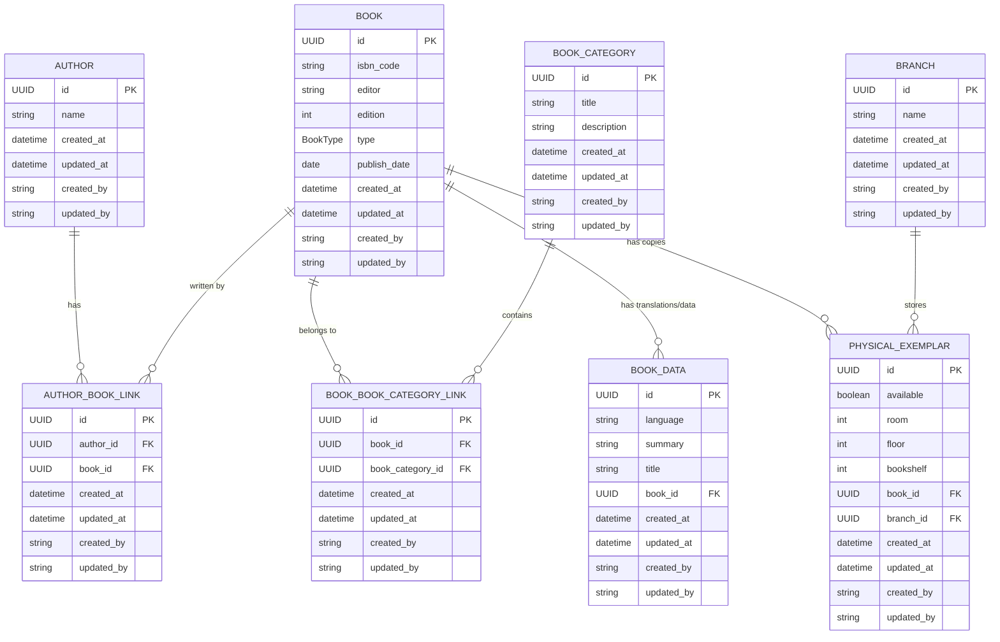
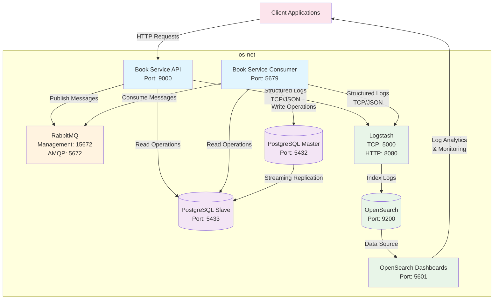

# Book Service

## Business Summary

**Book Service** is a comprehensive library management system designed to streamline book catalog operations and physical inventory management across multiple library branches. The system serves as the backbone for library operations, enabling librarians and administrators to efficiently manage their book collections, track physical inventory, and maintain detailed catalog information.

### Core Business Objectives

- **Centralized Book Management**: Maintain a comprehensive catalog of books with detailed metadata including ISBN codes, editions, authors, categories, and publication information
- **Multi-Branch Inventory Tracking**: Track physical book exemplars across different library branches with precise location information (room, floor, bookshelf)

## Database Schema

The system uses a PostgreSQL database with a well-structured relational schema designed for scalability and data integrity. All entities inherit from a base model with common audit fields (id, created_at, updated_at, created_by, updated_by).



### Entity Descriptions

- **Author**: Stores author information with indexed name field for efficient searching
- **Book**: Core entity containing book metadata (ISBN, editor, edition, type, publish date)
- **BookCategory**: Categorization system with unique titles for organizing books
- **BookData**: Multi-language support and additional book information (title translations, summaries)
- **Branch**: Library branch information for multi-location management
- **PhysicalExemplar**: Physical book tracking with precise location data (room, floor, bookshelf) and availability status
- **AuthorBookLink**: Many-to-many relationship between authors and books
- **BookBookCategoryLink**: Many-to-many relationship between books and categories

### Key Design Features

- **UUID Primary Keys**: Ensures global uniqueness and security
- **Audit Trail**: All entities track creation and modification timestamps with user attribution
- **Cascade Deletion**: Physical exemplars and book data are automatically removed when parent books are deleted
- **Indexed Fields**: Strategic indexing on frequently queried fields (author names, book titles, foreign keys)
- **Data Integrity**: Foreign key constraints maintain referential integrity across all relationships

## Integration Architecture

The Book Service implements a robust microservices architecture with comprehensive logging, monitoring, and data replication capabilities. The system is designed for high availability, scalability, and observability.



### Architecture Components

#### Application Services
- **Book Service API**: RESTful API service handling HTTP requests and business operations
- **Book Service Consumer**: Background service processing asynchronous messages from RabbitMQ
- **Event-Driven Communication**: All create, update, and delete operations are processed via RabbitMQ messages

#### Data Layer
- **PostgreSQL Master**: Primary database for all write operations and data consistency
- **PostgreSQL Slave**: Read replica for load distribution and improved read performance
- **Streaming Replication**: Real-time data synchronization between master and slave

#### Message Broker
- **RabbitMQ**: AMQP message broker handling asynchronous communication between services

#### Logging & Monitoring Stack
- **Logstash**: Log aggregation and processing engine receiving structured logs via TCP/JSON
- **OpenSearch**: Search and analytics engine for log storage and indexing
- **OpenSearch Dashboards**: Visualization platform for log analytics, monitoring, and alerting

## Package Management

This project uses **Poetry** as the dependency manager and build tool. Poetry provides deterministic dependency resolution, virtual environment management, and simplified package publishing.

### Prerequisites

- Python 3.11 or higher
- Poetry (latest version recommended)

### Installation

#### Install Poetry

```bash
# Using pip
pip install poetry

# Or using the official installer (recommended)
curl -sSL https://install.python-poetry.org | python3 -
```

#### Install Project Dependencies

```bash
# Clone the repository
git clone <repository-url>
cd book-service

# Install all dependencies (including dev dependencies)
poetry install

# Install only production dependencies
poetry install --only=main
```

### Development Setup

```bash
# Activate virtual environment
poetry shell

# Run the API service
poetry run python -m src.api

# Run the consumer service
poetry run python -m src.consumer

```

### Dependency Management

```bash
# Add new dependency
poetry add <package-name>

# Add development dependency
poetry add --group dev <package-name>

# Update dependencies
poetry update

# Show dependency tree
poetry show --tree
```

Poetry automatically manages virtual environments and ensures consistent dependency versions across all environments through the `poetry.lock` file.
