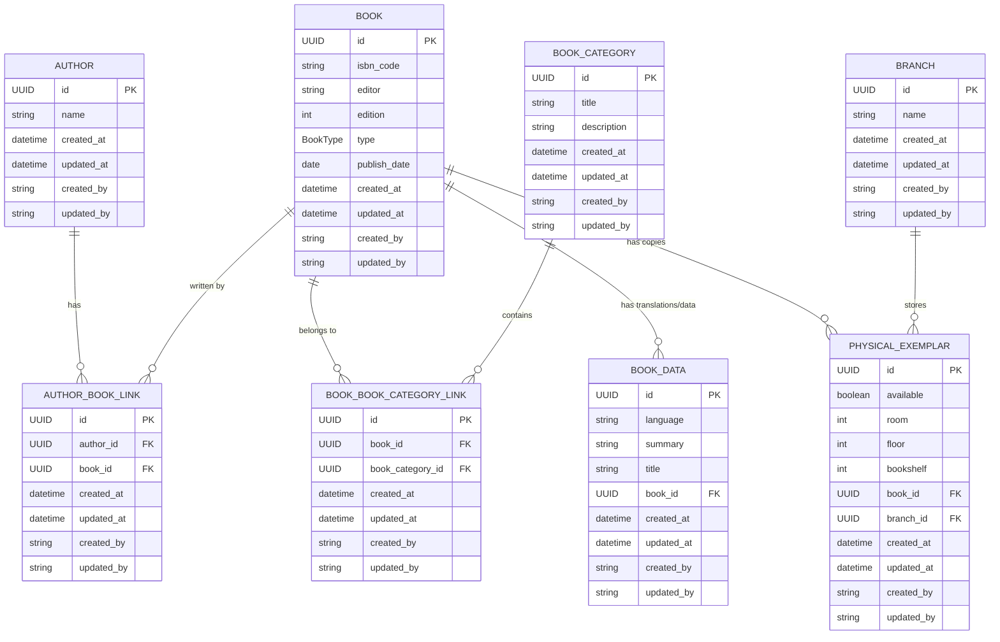
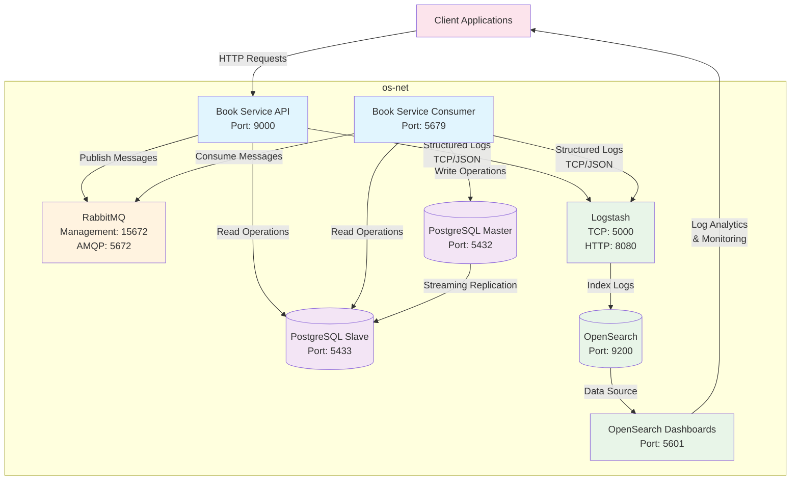

# Book Service

## Business Summary

**Book Service** is a comprehensive library management system designed to streamline book catalog operations and physical inventory management across multiple library branches. The system serves as the backbone for library operations, enabling librarians and administrators to efficiently manage their book collections, track physical inventory, and maintain detailed catalog information.

### Core Business Objectives

- **Centralized Book Management**: Maintain a comprehensive catalog of books with detailed metadata including ISBN codes, editions, authors, categories, and publication information
- **Multi-Branch Inventory Tracking**: Track physical book exemplars across different library branches with precise location information (room, floor, bookshelf)

## Database Schema

The system uses a PostgreSQL database with a well-structured relational schema designed for scalability and data integrity. All entities inherit from a base model with common audit fields (id, created_at, updated_at, created_by, updated_by).



### Entity Descriptions

- **Author**: Stores author information with indexed name field for efficient searching
- **Book**: Core entity containing book metadata (ISBN, editor, edition, type, publish date)
- **BookCategory**: Categorization system with unique titles for organizing books
- **BookData**: Multi-language support and additional book information (title translations, summaries)
- **Branch**: Library branch information for multi-location management
- **PhysicalExemplar**: Physical book tracking with precise location data (room, floor, bookshelf) and availability status
- **AuthorBookLink**: Many-to-many relationship between authors and books
- **BookBookCategoryLink**: Many-to-many relationship between books and categories

### Key Design Features

- **UUID Primary Keys**: Ensures global uniqueness and security
- **Audit Trail**: All entities track creation and modification timestamps with user attribution
- **Cascade Deletion**: Physical exemplars and book data are automatically removed when parent books are deleted
- **Indexed Fields**: Strategic indexing on frequently queried fields (author names, book titles, foreign keys)
- **Data Integrity**: Foreign key constraints maintain referential integrity across all relationships

## Integration Architecture

The Book Service implements a robust microservices architecture with comprehensive logging, monitoring, and data replication capabilities. The system is designed for high availability, scalability, and observability.



### Architecture Components

#### Application Services
- **Book Service API**: RESTful API service handling HTTP requests and business operations
- **Book Service Consumer**: Background service processing asynchronous messages from RabbitMQ
- **Event-Driven Communication**: All create, update, and delete operations are processed via RabbitMQ messages

#### Data Layer
- **PostgreSQL Master**: Primary database for all write operations and data consistency
- **PostgreSQL Slave**: Read replica for load distribution and improved read performance
- **Streaming Replication**: Real-time data synchronization between master and slave

#### Message Broker
- **RabbitMQ**: AMQP message broker handling asynchronous communication between services

#### Logging & Monitoring Stack
- **Logstash**: Log aggregation and processing engine receiving structured logs via TCP/JSON
- **OpenSearch**: Search and analytics engine for log storage and indexing
- **OpenSearch Dashboards**: Visualization platform for log analytics, monitoring, and alerting

## Package Management

This project uses **Poetry** as the dependency manager and build tool. Poetry provides deterministic dependency resolution, virtual environment management, and simplified package publishing.

### Prerequisites

- Python 3.11 or higher
- Poetry (latest version recommended)

### Installation

#### Install Poetry

```bash
# Using pip
pip install poetry

# Or using the official installer (recommended)
curl -sSL https://install.python-poetry.org | python3 -
```

#### Install Project Dependencies

```bash
# Clone the repository
git clone <repository-url>
cd book-service

# Install all dependencies (including dev dependencies)
poetry install

# Install only production dependencies
poetry install --only=main
```

### Development Setup

```bash
# Activate virtual environment
poetry shell

# Run the API service
poetry run python -m src.api

# Run the consumer service
poetry run python -m src.consumer

```

### Dependency Management

```bash
# Add new dependency
poetry add <package-name>

# Add development dependency
poetry add --group dev <package-name>

# Update dependencies
poetry update

# Show dependency tree
poetry show --tree
```

Poetry automatically manages virtual environments and ensures consistent dependency versions across all environments through the `poetry.lock` file.

### Make Commands

The project includes a `Makefile` with convenient commands for development, testing, and deployment tasks.

#### Development Environment

```bash
# Set up development environment with Poetry
make setup-dev-environment

# Database migrations
make alembic-generate    # Generate new migration files
make alembic-migrate     # Apply migrations to database
```

#### Docker Operations

```bash
# Build and run application
make build-application              # Build Docker images without cache
make run-application               # Start all services with docker-compose
make build-run-application         # Build and run in one command

# Testing environment
make build-application-test        # Build test environment images
make run-application-test-decouple # Start test services in detached mode
make get-application-test-logs     # Follow application test logs
make run-application-test          # Run complete test cycle (build, run, logs, stop)
make build-run-application-test    # Build and run test environment
```

#### System Cleanup

```bash
# Container management
make stop-containers      # Stop all running Docker containers
make clean-containers     # Remove stopped containers and system cleanup

# Volume management
make list-volumes-names   # Display all Docker volume names
make remove-volumes       # Remove all Docker volumes
make clean-volumes        # Complete cleanup (containers + volumes)
```

## Docker & Containerization

The Book Service uses **Docker** for containerization, providing consistent environments across development, testing, and production. The application leverages a multi-stage build process with **Google's Distroless images** for enhanced security and minimal attack surface.

### Multi-Stage Build Architecture

The Dockerfile implements a sophisticated multi-stage build strategy:

```dockerfile
# Build Stage: python:3.11-slim
├── Dependency installation with Poetry
├── Application code compilation
└── Python package preparation

# Production Stages: gcr.io/distroless/python3-debian12
├── API Service (distroless)
├── Consumer Service (distroless)
└── Minimal runtime environment
```

### Distroless Images

The production containers use **Google's Distroless Python images** (`gcr.io/distroless/python3-debian12:latest`):

#### **Security Benefits**
- **No Shell Access**: Eliminates shell-based attacks and reduces attack surface
- **Minimal Dependencies**: Contains only Python runtime and essential libraries
- **No Package Managers**: Removes apt, yum, and other package management tools
- **Reduced CVE Exposure**: Significantly fewer security vulnerabilities

#### **Operational Advantages**
- **Smaller Image Size**: Dramatically reduced container footprint
- **Faster Startup**: Minimal overhead for container initialization
- **Immutable Infrastructure**: No runtime modifications possible
- **Compliance Ready**: Meets strict security requirements for production environments

The distroless approach ensures that production containers contain only the necessary runtime components, making them more secure, smaller, and faster while maintaining full application functionality.

## Code Quality & Pre-commit Hooks

The project uses **Pre-commit** to enforce code quality standards and prevent common issues before code reaches the repository. Pre-commit automatically runs a series of checks and formatters on every git commit, ensuring consistent code quality across the entire codebase.

### What is Pre-commit?

Pre-commit is a framework for managing multi-language git pre-commit hooks. It automatically runs configured tools on your staged files before each commit, catching issues early in the development process and maintaining code quality standards.

### Installation & Setup

```bash
# Install pre-commit hooks
poetry run pre-commit install

# Run hooks manually on all files
poetry run pre-commit run --all-files

# Update hooks to latest versions
poetry run pre-commit autoupdate
```

### Configured Hooks

#### **File Quality Checks**
- **check-ast**: Validates Python syntax and AST parsing
- **trailing-whitespace**: Removes trailing whitespace from files
- **end-of-file-fixer**: Ensures files end with a newline
- **mixed-line-ending**: Standardizes line endings across files
- **check-added-large-files**: Prevents committing large files (excluding static assets)

#### **Format Validation**
- **check-toml**: Validates TOML file syntax (pyproject.toml, etc.)
- **check-json**: Validates JSON file syntax
- **pretty-format-json**: Formats JSON files consistently
- **check-xml**: Validates XML file syntax
- **check-yaml**: Validates YAML file syntax
- **pretty-format-yaml**: Formats YAML with consistent indentation

#### **Security Checks**
- **detect-aws-credentials**: Prevents accidental AWS credential commits
- **detect-private-key**: Detects private keys in commits
- **bandit**: Scans Python code for security vulnerabilities

#### **Python Code Quality**
- **black**: Code formatting and style enforcement
- **isort**: Import statement organization and sorting
- **autoflake**: Removes unused imports and variables
- **pyupgrade**: Upgrades Python syntax to modern standards

#### **Static Analysis**
- **flake8**: Linting and style guide enforcement (PEP 8)
- **pylint**: Advanced code analysis and quality metrics
- **mypy**: Static type checking and validation
- **debug-statements**: Detects leftover debug statements

#### **Commit Standards**
- **conventional-pre-commit**: Enforces conventional commit message format
- **add-trailing-comma**: Automatically adds trailing commas for consistency

### Quality Assurance Benefits

- **Automated Enforcement**: No manual intervention required for code formatting
- **Early Issue Detection**: Catches problems before code review
- **Consistent Standards**: Uniform code style across all contributors
- **Security Validation**: Prevents security issues from entering the codebase
- **Type Safety**: Static type checking reduces runtime errors
- **Documentation**: Conventional commits improve project history

All hooks run automatically on commit, but can also be executed manually for batch processing or CI/CD integration.

## System Design & Clean Architecture

The Book Service implements **Clean Architecture** principles with **Domain-Driven Design (DDD)** patterns, ensuring clear separation of concerns, testability, and maintainability. The architecture follows the dependency inversion principle where high-level modules don't depend on low-level modules.


### Architecture Layers

#### **Domain Layer** (`src/domain/`)
The innermost layer containing business logic and rules, completely independent of external concerns.

- **Entities**: Core business objects with identity and lifecycle (Book, Author, Branch, BookCategory, PhysicalExemplar)
- **Value Objects**: Immutable objects representing business concepts (BookType enum, BaseEntity)
- **Business Rules**: Domain logic encapsulated within entities
- **No Dependencies**: Pure business logic with no external framework dependencies

#### **Application Layer** (`src/application/`)
Orchestrates business operations and defines application-specific logic.

- **Use Cases**: Single-purpose business operations (UpsertBook, FilterAuthor, DeleteBook)
- **Ports**: Abstract interfaces defining contracts with external systems
  - **Repository Ports**: Data access contracts (BookRepositoryPort, AuthorRepositoryPort)
  - **Producer Ports**: Message publishing contracts (BookProducerPort, AuthorProducerPort)
- **DTOs**: Data transfer objects for external communication
- **Application Services**: Coordinate between use cases and external systems

#### **Infrastructure Layer** (`src/infrastructure/`)
Implements technical details and external system integrations.

- **Entry Points**: External interfaces (API routes, message consumers)
- **Repository Implementations**: Concrete data access implementations using SQLModel/PostgreSQL
- **Producer Implementations**: Message publishing implementations using RabbitMQ
- **External Services**: Database connections, message brokers, logging systems
- **Configuration**: Application settings and dependency injection

#### **Event-Driven Architecture**
All modifications flow through message queues:
- **API Layer**: Publishes events for create/update/delete operations
- **Consumer Layer**: Processes events and executes database operations
- **Separation**: Read operations via API, write operations via consumers

### SOLID Principles Implementation

- **Single Responsibility**: Each use case handles one business operation
- **Open/Closed**: New features added through new use cases, not modifications
- **Liskov Substitution**: Repository implementations are interchangeable
- **Interface Segregation**: Focused, cohesive port interfaces
- **Dependency Inversion**: High-level modules depend on abstractions

### Benefits

- **Testability**: Easy mocking through port interfaces
- **Maintainability**: Clear separation of concerns and responsibilities
- **Flexibility**: Swappable implementations without business logic changes
- **Independence**: Domain logic isolated from external framework dependencies
- **Scalability**: Event-driven architecture enables horizontal scaling
