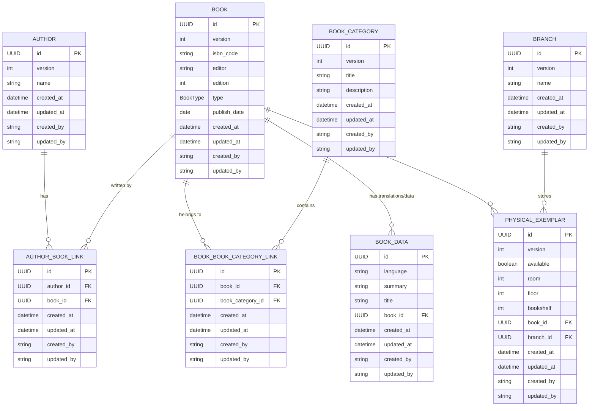
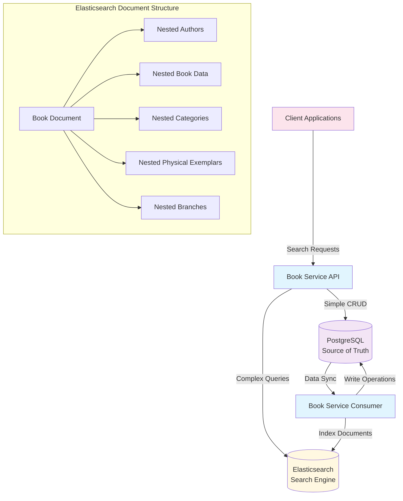
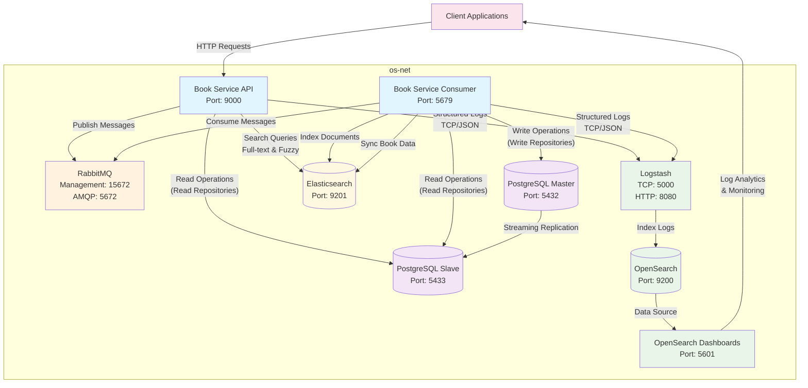
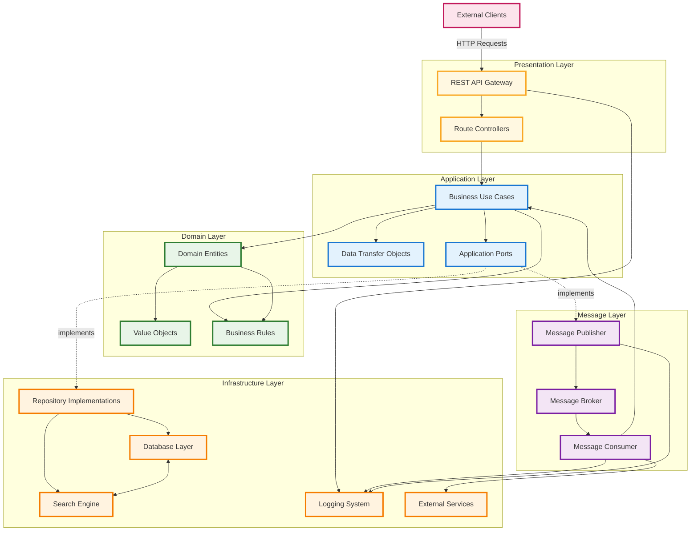

# Book Service

## Business Summary

**Book Service** is a comprehensive library management system designed to streamline book catalog operations and physical inventory management across multiple library branches. The system serves as the backbone for library operations, enabling librarians and administrators to efficiently manage their book collections, track physical inventory, and maintain detailed catalog information.

## Quick Start

**🚀 Want to run the application and tests quickly?**

Jump directly to the **[Make Commands](#make-commands)** section! All Docker complexity is abstracted away through simple make commands:

```bash
# Run the complete application stack
make build-run-application

# Run tests in containerized environment
make build-run-test

# View application logs
make get-application-logs
```

The Make commands handle all Docker orchestration, dependency management, and environment setup automatically - no need to understand the underlying infrastructure details to get started.

### 🌐 Quick Access Endpoints

Once the application is running with `make build-run-application`, you can access:

- **📚 FastAPI Documentation (Swagger UI)**: [http://localhost:9000/docs](http://localhost:9000/docs)
  - Interactive API documentation with request/response examples
  - Test API endpoints directly from the browser
  - View all available routes and schemas

- **🔍 Elasticsearch**: [http://localhost:9201](http://localhost:9201)
  - Advanced search engine for book data queries
  - Full-text search, fuzzy matching, and complex aggregations
  - RESTful API for direct query execution

- **📊 OpenSearch Dashboard**: [http://localhost:5601](http://localhost:5601)
  - Log analytics and monitoring interface
  - Search and visualize application logs
  - Create custom dashboards and alerts

- **🐰 RabbitMQ Management**: [http://localhost:15672](http://localhost:15672)
  - Message queue monitoring and management
  - Default credentials: `kalo` / `kalo`

### Core Business Objectives

- **Centralized Book Management**: Maintain a comprehensive catalog of books with detailed metadata including ISBN codes, editions, authors, categories, and publication information
- **Multi-Branch Inventory Tracking**: Track physical book exemplars across different library branches with precise location information (room, floor, bookshelf)

## Technology Stack

The Book Service is built on a modern Python technology stack that emphasizes **type safety**, **performance**, and **developer experience**. The core foundation consists of three complementary technologies that work seamlessly together.

### FastAPI Framework

**FastAPI** serves as the high-performance web framework providing:

- **Automatic API Documentation**: Self-generating OpenAPI/Swagger documentation with interactive testing interface
- **Type-Based Validation**: Automatic request/response validation using Python type hints
- **Async Support**: Native asynchronous programming support for high-concurrency operations
- **Performance**: One of the fastest Python frameworks, comparable to Node.js and Go
- **Modern Python**: Built on Python 3.7+ with full type hint support and modern async/await patterns

### SQLModel (Data Layer)

**SQLModel** combines the best of SQLAlchemy and Pydantic for database operations:

- **Unified Models**: Single model definition for both database schema and API serialization
- **Type Safety**: Full type checking support with automatic IDE completion
- **SQLAlchemy Core**: Built on SQLAlchemy's proven ORM with relationship management
- **Pydantic Integration**: Seamless data validation and serialization using Pydantic models
- **Migration Support**: Alembic integration for database schema versioning and migrations

### Pydantic (Data Validation)

**Pydantic** provides robust data validation and serialization:

- **Automatic Validation**: Type-based validation with detailed error messages
- **Data Transformation**: Automatic type conversion and data cleaning
- **Serialization**: JSON serialization/deserialization with custom encoders
- **Settings Management**: Environment-based configuration with validation
- **Documentation Generation**: Automatic schema generation for API documentation

### Elasticsearch (Search Engine)

**Elasticsearch** serves as the advanced search engine for book data:

- **Full-Text Search**: Multi-field search across titles, summaries, authors, and categories
- **Fuzzy Matching**: Typo-tolerant search with configurable fuzziness levels
- **Nested Queries**: Complex searches within nested document structures
- **Real-Time Indexing**: Near real-time search capabilities with 1-second refresh interval
- **Scalable Architecture**: Horizontal scaling with sharding and replication support

## Database Schema

The system uses a **dual-database architecture** combining PostgreSQL for transactional operations and Elasticsearch for advanced search capabilities. PostgreSQL serves as the source of truth with a well-structured relational schema designed for scalability and data integrity. All entities inherit from a base model with common audit fields (id, created_at, updated_at, created_by, updated_by).



### Entity Descriptions

- **Author**: Stores author information with indexed name field for efficient searching
- **Book**: Core entity containing book metadata (ISBN, editor, edition, type, publish date)
- **BookCategory**: Categorization system with unique titles for organizing books
- **BookData**: Multi-language support and additional book information (title translations, summaries)
- **Branch**: Library branch information for multi-location management
- **PhysicalExemplar**: Physical book tracking with precise location data (room, floor, bookshelf) and availability status
- **AuthorBookLink**: Many-to-many relationship between authors and books
- **BookBookCategoryLink**: Many-to-many relationship between books and categories

### Key Design Features

- **UUID Primary Keys**: Ensures global uniqueness and security
- **Audit Trail**: All entities track creation and modification timestamps with user attribution
- **Cascade Deletion**: Physical exemplars and book data are automatically removed when parent books are deleted
- **Indexed Fields**: Strategic indexing on frequently queried fields (author names, book titles, foreign keys)
- **Data Integrity**: Foreign key constraints maintain referential integrity across all relationships
- **Optimistic Locking**: Version fields prevent concurrent modification conflicts

### Optimistic Locking

The Book Service implements **optimistic locking** to handle concurrent modifications and prevent data corruption in multi-user environments. This pattern assumes that conflicts are rare and checks for conflicts only when data is being updated.

#### **How It Works**

Each core entity (`Author`, `Book`, `BookCategory`, `Branch`, `PhysicalExemplar`) includes a `version` field that:

- **Starts at 1**: New entities begin with version 1
- **Increments on Update**: Each successful update increments the version by 1
- **Validates on Write**: Updates require the current version number to succeed

#### **Implementation Pattern**

```python
# Update operation with optimistic locking
statement = (
    update(BookModel)
    .where(
        and_(
            BookModel.id == book.id,
            BookModel.version == book.version - 1,  # Check current version
        ),
    )
    .values(**book.model_dump())
)
result = session.exec(statement)
if result.rowcount == 0:
    raise OptimisticLockException(
        f"Optimistic lock failed for book {book.id}. "
        f"Expected version {book.version - 1}, "
        f"but data may have been modified by another transaction."
    )
```

#### **Conflict Resolution**

When a concurrent modification is detected:

1. **Detection**: The version check fails during update
2. **Exception**: `OptimisticLockException` is raised with descriptive message
3. **Retry Logic**: Use cases may implement retry mechanisms if needed
4. **User Feedback**: Applications can prompt users to refresh and retry

#### **Benefits**

- **Performance**: No locking overhead during reads
- **Scalability**: Supports high-concurrency scenarios
- **Data Integrity**: Prevents lost updates and inconsistent state
- **User Experience**: Clear feedback when conflicts occur

#### **Coverage**

Optimistic locking is implemented for all core business entities:

- **Author**: Version-controlled author information updates
- **Book**: Version-controlled book metadata and relationships
- **BookCategory**: Version-controlled category management
- **Branch**: Version-controlled branch information
- **PhysicalExemplar**: Version-controlled inventory tracking

**Note**: Link tables (`AuthorBookLink`, `BookBookCategoryLink`) and `BookData` don't implement optimistic locking as they are managed through their parent entities' transactions.

## Elasticsearch Search Engine

The Book Service leverages **Elasticsearch** as a powerful search engine for complex book data queries, providing advanced full-text search, fuzzy matching, and aggregation capabilities. This dual-database architecture separates transactional operations (PostgreSQL) from search operations (Elasticsearch) for optimal performance.

### Search Engine Architecture



### Document Structure

Elasticsearch stores denormalized book documents with all related data embedded as nested objects, enabling complex queries without joins:

### Search Capabilities

#### **Full-Text Search**
- **Multi-field Search**: Search across titles, summaries, author names, and categories
- **Relevance Scoring**: Advanced scoring algorithms prioritize most relevant results
- **Language Analysis**: Standard analyzer with English stopwords for better search quality

#### **Fuzzy Matching**
- **Typo Tolerance**: Automatic correction of spelling mistakes in search queries
- **Configurable Fuzziness**: AUTO fuzziness adapts to query term length
- **Phonetic Matching**: Similar-sounding terms return relevant results

#### **Advanced Query Types**
- **Nested Queries**: Search within nested objects (authors, book data, categories)
- **Range Queries**: Date ranges, edition numbers, and numeric fields
- **Boolean Queries**: Complex combinations with AND/OR/NOT logic
- **Term Queries**: Exact matches on keyword fields (ISBN, type, language)

### Performance Optimizations

#### **Index Configuration**
- **Single Shard**: Optimized for moderate data volumes with fast queries
- **Refresh Interval**: 1-second refresh for near real-time search
- **Result Window**: 10,000 maximum results for deep pagination
- **Memory Settings**: 512MB heap size for containerized deployment

#### **Mapping Optimizations**
- **Keyword Fields**: Dual mapping (text + keyword) for flexible querying
- **Nested Objects**: Efficient storage and querying of related data
- **Date Formats**: Strict date-time format for consistent date handling
- **Analyzer Configuration**: Standard analyzer with English stopwords

### Data Synchronization

#### **Event-Driven Updates**
- **Real-time Sync**: Book changes trigger immediate Elasticsearch updates
- **Atomic Operations**: Updates are transactional across PostgreSQL and Elasticsearch
- **Error Handling**: Failed indexing operations are logged and retried

#### **Consistency Strategy**
- **PostgreSQL as Source of Truth**: All writes go to PostgreSQL first
- **Eventual Consistency**: Elasticsearch reflects PostgreSQL state with minimal delay
- **Conflict Resolution**: PostgreSQL data takes precedence in case of conflicts

### Monitoring and Maintenance

#### **Health Monitoring**
- **Cluster Health**: Automatic health checks every 10 seconds
- **Index Statistics**: Document count, storage size, and query performance
- **Connection Resilience**: Automatic reconnection on connection failures

#### **Configuration Management**
- **Environment Variables**: Configurable connection settings and index parameters
- **Index Templates**: Consistent mapping and settings across environments
- **Backup Strategy**: Index snapshots for data recovery and migration

## Integration Architecture

The Book Service implements a robust microservices architecture with comprehensive logging, monitoring, data replication, and advanced search capabilities. The system is designed for high availability, scalability, and observability with dual search engines for different purposes.



### Architecture Components

#### Application Services
- **Book Service API**: RESTful API service handling HTTP requests and business operations
- **Book Service Consumer**: Background service processing asynchronous messages from RabbitMQ
- **Event-Driven Communication**: All create, update, and delete operations are processed via RabbitMQ messages

#### Data Layer
- **PostgreSQL Master**: Primary database for all write operations and data consistency
- **PostgreSQL Slave**: Read replica for load distribution and improved read performance
- **Streaming Replication**: Real-time data synchronization between master and slave
- **CQRS Implementation**: Separate read and write repositories optimize database usage

#### Search Engine Layer
- **Elasticsearch**: Advanced search engine for book data with full-text search, fuzzy matching, and complex queries
- **Dual-Purpose Architecture**: Elasticsearch for book search, OpenSearch for log analytics

#### Message Broker
- **RabbitMQ**: AMQP message broker handling asynchronous communication between services

#### Logging & Monitoring Stack
- **Logstash**: Log aggregation and processing engine receiving structured logs via TCP/JSON
- **OpenSearch**: Search and analytics engine for log storage and indexing
- **OpenSearch Dashboards**: Visualization platform for log analytics, monitoring, and alerting

## Package Management

This project uses **Poetry** as the dependency manager and build tool. Poetry provides deterministic dependency resolution, virtual environment management, and simplified package publishing.

### Prerequisites

- Python 3.11 or higher
- Poetry (latest version recommended)

### Installation

#### Install Poetry

```bash
# Using pip
pip install poetry

# Or using the official installer (recommended)
curl -sSL https://install.python-poetry.org | python3 -
```

#### Install Project Dependencies

```bash
# Clone the repository
git clone <repository-url>
cd book-service

# Install all dependencies (including dev dependencies)
poetry install

# Install only production dependencies
poetry install --only=main
```

### Development Setup

```bash
# Activate virtual environment
poetry shell

# Run the API service
poetry run python -m src.api

# Run the consumer service
poetry run python -m src.consumer

```

### Dependency Management

```bash
# Add new dependency
poetry add <package-name>

# Add development dependency
poetry add --group dev <package-name>

# Update dependencies
poetry update

# Show dependency tree
poetry show --tree
```

Poetry automatically manages virtual environments and ensures consistent dependency versions across all environments through the `poetry.lock` file.

### Make Commands

The project includes a comprehensive `Makefile` with convenient commands for development, testing, and deployment tasks. All Docker complexity is abstracted away through simple make commands - no need to understand the underlying infrastructure details to get started.

**🚀 Quick Help**: Run `make` without arguments to see all available commands with descriptions.

#### Environment Setup

```bash
# Set up development environment with Poetry dependencies
make setup-dev-environment
```

#### Database Migration

```bash
# Generate new migration from model changes
make alembic-generate

# Run pending migrations
make alembic-migrate
```

#### Application Management

```bash
# Build Docker containers without cache
make build-application

# Start the application with docker-compose
make run-application

# Build and run the application in one command
make build-run-application
```

#### Testing

```bash
# Build test environment containers
make build-application-test

# Run tests in detached mode and show logs
make run-application-test

# Run test containers in background
make run-application-test-decouple

# Show test application logs
make get-application-test-logs

# Build and run test environment
make build-run-application-test
```

#### Cleanup

```bash
# Stop all running Docker containers
make stop-containers

# Remove stopped containers and prune system
make clean-containers

# List all Docker volume names
make list-volumes-names

# Remove all Docker volumes
make remove-volumes

# Clean containers and remove all volumes
make clean-volumes
```

**Usage**: `make <command>`

**Examples**:
```bash
# Complete development workflow
make build-run-application          # Start the full application stack
make build-run-application-test     # Run tests in containerized environment
make clean-volumes                  # Clean up all resources when done
```

## Docker & Containerization

The Book Service uses **Docker** for containerization, providing consistent environments across development, testing, and production. The application leverages a multi-stage build process with **Google's Distroless images** for enhanced security and minimal attack surface.

### Multi-Stage Build Architecture

The Dockerfile implements a sophisticated multi-stage build strategy:

```dockerfile
# Build Stage: python:3.11-slim
├── Dependency installation with Poetry
├── Application code compilation
└── Python package preparation

# Production Stages: gcr.io/distroless/python3-debian12
├── API Service (distroless)
├── Consumer Service (distroless)
└── Minimal runtime environment
```

### Distroless Images

The production containers use **Google's Distroless Python images** (`gcr.io/distroless/python3-debian12:latest`):

#### **Security Benefits**
- **No Shell Access**: Eliminates shell-based attacks and reduces attack surface
- **Minimal Dependencies**: Contains only Python runtime and essential libraries
- **No Package Managers**: Removes apt, yum, and other package management tools
- **Reduced CVE Exposure**: Significantly fewer security vulnerabilities

#### **Operational Advantages**
- **Smaller Image Size**: Dramatically reduced container footprint
- **Faster Startup**: Minimal overhead for container initialization
- **Immutable Infrastructure**: No runtime modifications possible
- **Compliance Ready**: Meets strict security requirements for production environments

The distroless approach ensures that production containers contain only the necessary runtime components, making them more secure, smaller, and faster while maintaining full application functionality.

## Code Quality & Pre-commit Hooks

The project uses **Pre-commit** to enforce code quality standards and prevent common issues before code reaches the repository. Pre-commit automatically runs a series of checks and formatters on every git commit, ensuring consistent code quality across the entire codebase.

### What is Pre-commit?

Pre-commit is a framework for managing multi-language git pre-commit hooks. It automatically runs configured tools on your staged files before each commit, catching issues early in the development process and maintaining code quality standards.

### Installation & Setup

```bash
# Install pre-commit hooks
poetry run pre-commit install

# Run hooks manually on all files
poetry run pre-commit run --all-files

# Update hooks to latest versions
poetry run pre-commit autoupdate
```

### Configured Hooks

#### **File Quality Checks**
- **check-ast**: Validates Python syntax and AST parsing
- **trailing-whitespace**: Removes trailing whitespace from files
- **end-of-file-fixer**: Ensures files end with a newline
- **mixed-line-ending**: Standardizes line endings across files
- **check-added-large-files**: Prevents committing large files (excluding static assets)

#### **Format Validation**
- **check-toml**: Validates TOML file syntax (pyproject.toml, etc.)
- **check-json**: Validates JSON file syntax
- **pretty-format-json**: Formats JSON files consistently
- **check-xml**: Validates XML file syntax
- **check-yaml**: Validates YAML file syntax
- **pretty-format-yaml**: Formats YAML with consistent indentation

#### **Security Checks**
- **detect-aws-credentials**: Prevents accidental AWS credential commits
- **detect-private-key**: Detects private keys in commits
- **bandit**: Scans Python code for security vulnerabilities

#### **Python Code Quality**
- **black**: Code formatting and style enforcement
- **isort**: Import statement organization and sorting
- **autoflake**: Removes unused imports and variables
- **pyupgrade**: Upgrades Python syntax to modern standards

#### **Static Analysis**
- **flake8**: Linting and style guide enforcement (PEP 8)
- **pylint**: Advanced code analysis and quality metrics
- **mypy**: Static type checking and validation
- **debug-statements**: Detects leftover debug statements

#### **Commit Standards**
- **conventional-pre-commit**: Enforces conventional commit message format
- **add-trailing-comma**: Automatically adds trailing commas for consistency

### Quality Assurance Benefits

- **Automated Enforcement**: No manual intervention required for code formatting
- **Early Issue Detection**: Catches problems before code review
- **Consistent Standards**: Uniform code style across all contributors
- **Security Validation**: Prevents security issues from entering the codebase
- **Type Safety**: Static type checking reduces runtime errors
- **Documentation**: Conventional commits improve project history

All hooks run automatically on commit, but can also be executed manually for batch processing or CI/CD integration.

## System Design & Clean Architecture

The Book Service implements **Clean Architecture** principles with **Domain-Driven Design (DDD)** patterns, ensuring clear separation of concerns, testability, and maintainability. The architecture follows the dependency inversion principle where high-level modules don't depend on low-level modules.


### Architecture Layers

#### **Domain Layer** (`src/domain/`)
The innermost layer containing business logic and rules, completely independent of external concerns.

- **Entities**: Core business objects with identity and lifecycle (Book, Author, Branch, BookCategory, PhysicalExemplar)
- **Value Objects**: Immutable objects representing business concepts (BookType enum, BaseEntity)
- **Business Rules**: Domain logic encapsulated within entities
- **No Dependencies**: Pure business logic with no external framework dependencies

#### **Application Layer** (`src/application/`)
Orchestrates business operations and defines application-specific logic.

- **Use Cases**: Single-purpose business operations (UpsertBook, FilterAuthor, DeleteBook)
- **Ports**: Abstract interfaces defining contracts with external systems
  - **Repository Ports**: Data access contracts following CQRS pattern
    - **Read Ports**: Optimized for query operations (BookReadRepositoryPort, AuthorReadRepositoryPort)
    - **Write Ports**: Optimized for command operations (BookWriteRepositoryPort, AuthorWriteRepositoryPort)
  - **Producer Ports**: Message publishing contracts (BookProducerPort, AuthorProducerPort)
- **DTOs**: Data transfer objects for external communication
- **Application Services**: Coordinate between use cases and external systems

#### **Infrastructure Layer** (`src/infrastructure/`)
Implements technical details and external system integrations.

- **Entry Points**: External interfaces (API routes, message consumers)
- **Repository Implementations**: Concrete data access implementations using SQLModel/PostgreSQL
  - **Read Repositories**: Optimized for query performance using slave database connections
  - **Write Repositories**: Optimized for command operations using master database connections
- **Producer Implementations**: Message publishing implementations using RabbitMQ
- **External Services**: Database connections, message brokers, logging systems
- **Configuration**: Application settings and dependency injection

#### **Event-Driven Architecture**
All modifications flow through message queues:
- **API Layer**: Publishes events for create/update/delete operations
- **Consumer Layer**: Processes events and executes database operations
- **Separation**: Read operations via API, write operations via consumers

### SOLID Principles Implementation

- **Single Responsibility**: Each use case handles one business operation
- **Open/Closed**: New features added through new use cases, not modifications
- **Liskov Substitution**: Repository implementations are interchangeable
- **Interface Segregation**: Focused, cohesive port interfaces
- **Dependency Inversion**: High-level modules depend on abstractions

### CQRS (Command Query Responsibility Segregation)

The repository layer implements **CQRS pattern** for enhanced scalability and performance:

#### **Read Repositories** (`*ReadRepository`)
- **Purpose**: Optimized for query operations and data retrieval
- **Database Connection**: Uses slave database connections for load distribution
- **Characteristics**:
  - Read-only operations (get_by_id, get_by_filter, search)
  - Optimized for query performance
  - Can leverage read replicas and caching
  - Separate from write concerns

#### **Write Repositories** (`*WriteRepository`)
- **Purpose**: Optimized for command operations and data persistence
- **Database Connection**: Uses master database connections for consistency
- **Characteristics**:
  - Write operations (upsert, delete, create)
  - Transactional consistency
  - Data integrity enforcement
  - Separate from read concerns

#### **CQRS Benefits**
- **Performance Optimization**: Different optimizations for reads vs writes
- **Scalability**: Independent scaling of read and write operations
- **Database Load Distribution**: Reads use slave, writes use master
- **Flexibility**: Different data models for queries vs commands
- **Fault Isolation**: Read failures don't affect write operations

### Benefits

- **Testability**: Easy mocking through port interfaces
- **Maintainability**: Clear separation of concerns and responsibilities
- **Flexibility**: Swappable implementations without business logic changes
- **Independence**: Domain logic isolated from external framework dependencies
- **Scalability**: Event-driven architecture and CQRS pattern enable horizontal scaling

### System Architecture Overview

The following diagram illustrates how the design system components integrate with each other:



#### **Core Integration Patterns**

**🔄 Request Flow**
- **External Clients** send requests to the **REST API Gateway**
- **Route Controllers** handle HTTP concerns and delegate to **Business Use Cases**
- **Use Cases** orchestrate business logic using **Domain Entities** and **Business Rules**

**🎯 Clean Architecture Layers**
- **Domain Layer** (innermost) - Contains pure business logic, independent of external concerns
- **Application Layer** - Orchestrates business operations, defines contracts via **Ports**
- **Infrastructure Layer** - Implements technical details and external system integrations
- **Presentation Layer** - Handles external communication protocols

**📨 Event-Driven Communication**
- **Message Publisher** sends events to **Message Broker** for asynchronous processing
- **Message Consumer** processes events and triggers **Use Cases** for data persistence
- This pattern separates read operations (direct API) from write operations (via messaging)

**🔌 Dependency Inversion**
- **Application Ports** define contracts that **Infrastructure** components implement
- **Use Cases** depend on abstractions, not concrete implementations
- This enables easy testing and swapping of implementations

**💾 Data Management**
- **Read Repositories** handle optimized query operations using slave database connections
- **Write Repositories** handle data persistence and modifications using master database connections
- **Search Engine** provides advanced querying capabilities with full-text search
- Data synchronization occurs between database and search engine
- **CQRS Pattern** enables independent scaling and optimization of read vs write operations

**🔍 Cross-Cutting Concerns**
- **Logging System** captures events from all layers for monitoring and debugging
- **External Services** integration happens through the messaging layer
- **Data Transfer Objects** ensure clean data flow between layers

## Testing Strategy

The Book Service implements a comprehensive testing strategy following the **Testing Pyramid** principles, with clear separation between **Unit Tests** and **Integration Tests**. The test suite ensures high code coverage, reliability, and maintainability across all architectural layers.

### Test Organization

The test suite is organized into two main categories, mirroring the source code structure:

```
tests/
├── unit/                    # Fast, isolated tests with mocks
│   ├── author/
│   │   ├── usecase/        # Business logic tests
│   │   ├── repository/     # Data access tests
│   │   └── producer/       # Message publishing tests
│   ├── book/
│   ├── branch/
│   ├── book_category/
│   └── physical_exemplar/
├── integration/             # Slower tests with real dependencies
│   ├── author/             # End-to-end API tests
│   ├── book/
│   ├── branch/
│   ├── book_category/
│   └── physical_exemplar/
└── conftest.py             # Shared test configurations
```

### Unit Tests (`tests/unit/`)

Unit tests focus on testing individual components in **complete isolation** using mocks and stubs.

#### **Characteristics**
- **Fast Execution**: Run in milliseconds without external dependencies
- **Isolated**: Use mocks for all external dependencies (database, message broker, APIs)
- **Focused**: Test single functions/methods with specific scenarios
- **Deterministic**: Predictable outcomes with controlled inputs

#### **Test Categories**

**Use Case Tests** (`usecase/`):
- Test business logic orchestration
- Validate use case execution flow
- Mock all repository and producer dependencies
- Focus on business rule validation

**Repository Tests** (`repository/`):
- Test data access layer with real database connections
- Validate CRUD operations and queries
- Test data transformation between entities and models
- Database transaction and error handling

**Producer Tests** (`producer/`):
- Test message publishing functionality
- Mock message broker dependencies
- Validate message formatting and routing

#### **Mock Strategy**
Unit tests use `unittest.mock` for dependency isolation:

### Integration Tests (`tests/integration/`)

Integration tests validate **complete workflows** using real external dependencies and the full application stack.

#### **Characteristics**
- **Real Dependencies**: Uses actual PostgreSQL database, RabbitMQ, and FastAPI application
- **End-to-End**: Tests complete request/response cycles through API
- **Slower Execution**: Higher latency due to database and network operations
- **Comprehensive**: Validates integration between all system components

#### **Test Setup**
- **Real Database**: PostgreSQL connection with test data isolation
- **FastAPI TestClient**: HTTP client for API endpoint testing
- **Message Consumer**: Real RabbitMQ consumer for event processing
- **Data Cleanup**: Automatic test data cleanup between tests

### Test Data Management

#### **Factory Pattern**
Both test types use **Polyfactory** for generating test data:

#### **Data Isolation**
- **Unit Tests**: No persistence, pure in-memory objects
- **Integration Tests**: Database transactions with cleanup after each test
- **Test Independence**: Each test runs in isolation without side effects

### Coverage and Quality

#### **Coverage Targets**
- **Minimum Coverage**: 80% (enforced in pyproject.toml)
- **Focus Areas**: High coverage on use cases and repositories
- **Exclusions**: Database models, exceptions, and infrastructure configuration

#### **Test Execution**
```bash
# Run all tests
poetry run pytest

# Run only unit tests
poetry run pytest tests/unit/

# Run only integration tests
poetry run pytest tests/integration/

# Run with coverage
poetry run coverage run -m pytest
poetry run coverage report
```
