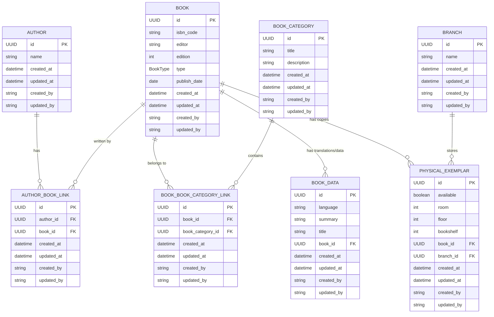

# Book Service

## Business Summary

**Book Service** is a comprehensive library management system designed to streamline book catalog operations and physical inventory management across multiple library branches. The system serves as the backbone for library operations, enabling librarians and administrators to efficiently manage their book collections, track physical inventory, and maintain detailed catalog information.

### Core Business Objectives

- **Centralized Book Management**: Maintain a comprehensive catalog of books with detailed metadata including ISBN codes, editions, authors, categories, and publication information
- **Multi-Branch Inventory Tracking**: Track physical book exemplars across different library branches with precise location information (room, floor, bookshelf)

## Database Schema

The system uses a PostgreSQL database with a well-structured relational schema designed for scalability and data integrity. All entities inherit from a base model with common audit fields (id, created_at, updated_at, created_by, updated_by).

### Entity Descriptions

- **Author**: Stores author information with indexed name field for efficient searching
- **Book**: Core entity containing book metadata (ISBN, editor, edition, type, publish date)
- **BookCategory**: Categorization system with unique titles for organizing books
- **BookData**: Multi-language support and additional book information (title translations, summaries)
- **Branch**: Library branch information for multi-location management
- **PhysicalExemplar**: Physical book tracking with precise location data (room, floor, bookshelf) and availability status
- **AuthorBookLink**: Many-to-many relationship between authors and books
- **BookBookCategoryLink**: Many-to-many relationship between books and categories

### Key Design Features

- **UUID Primary Keys**: Ensures global uniqueness and security
- **Audit Trail**: All entities track creation and modification timestamps with user attribution
- **Cascade Deletion**: Physical exemplars and book data are automatically removed when parent books are deleted
- **Indexed Fields**: Strategic indexing on frequently queried fields (author names, book titles, foreign keys)
- **Data Integrity**: Foreign key constraints maintain referential integrity across all relationships
